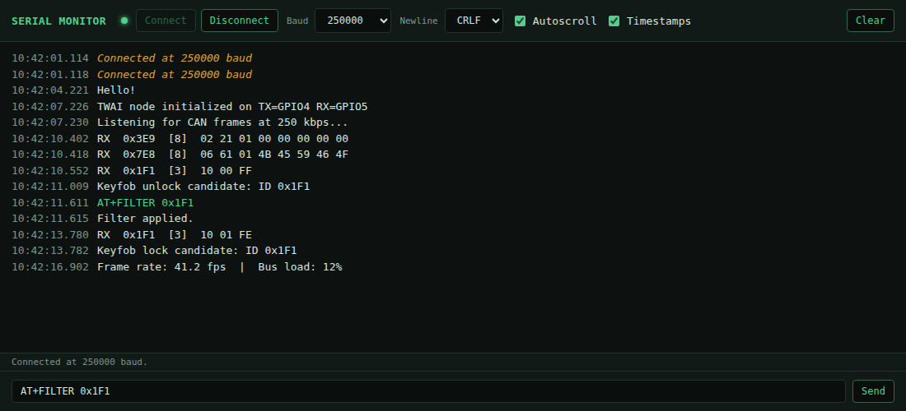

[README.md](https://github.com/user-attachments/files/31275232/README.md)
## Browser Serial Monitor

A super-simple browser-based serial monitor for Arduino/embedded projects. 
# Serial Monitor

A single-file, browser-based serial monitor for Arduino/ESP32 projects. No install, no drivers beyond what your OS already uses — just open the HTML file in a Chromium-based browser and connect.

*(Log contents above are dummy data for illustration — not live output.)*

## Requirements

- **Chrome, Edge, or Opera.** This uses the [Web Serial API](https://developer.mozilla.org/en-US/docs/Web/API/Web_Serial_API), which Firefox and Safari don't support.
- Served over **HTTPS**, or opened directly from disk (`file://` works fine too).

## Getting started

1. Open your own local copy of index.html, or use the Netlify hosted version here: https://browserserialmonitor.netlify.app/.
2. Plug in your board.
3. Set the **Baud** dropdown to match your sketch's `Serial.begin(...)` rate (or pick **Custom…** for anything not listed).
4. Click **Connect** and select your board's port from the browser's picker.
5. Serial output streams into the log in real time.

## Features

| Control | What it does |
|---|---|
| **Connect / Disconnect** | Opens the native OS port picker; closes the port cleanly when done. |
| **Baud** | Standard rates from 300–921600, plus a custom field for anything else. |
| **Newline** | Line ending appended to outgoing messages: LF, CR, CRLF, or none. |
| **Autoscroll** | Keeps the log pinned to the latest line. Turns off automatically if you scroll up to read history. |
| **Timestamps** | Toggles the per-line time-of-receipt column. |
| **Clear** | Wipes the log view. |
| **Send box** | Type a message and hit Enter (or click Send) to write to the board. |

## Log color key

- **White** — incoming data from the device (RX)
- **Green** — data you sent (TX)
- **Yellow/italic** — connection status messages (connect/disconnect)
- **Red** — errors

## Notes on common issues

- **Garbled characters right after connecting:** many boards (especially ESP32) print bootloader text at a fixed rate (often 74880 or 115200) before your sketch's `Serial.begin()` runs. If your monitor is set to a different rate, that boot text will look like noise — this is normal and clears up once your own `Serial` output starts.
- **Nothing logs at all:** double check the board isn't using the same GPIO pins for another peripheral (e.g. CAN/TWAI) that it needs for UART TX/RX — a peripheral claiming those pins will silently kill the serial connection.
- **Data only appears when you disconnect:** usually a sign the board's `Serial` output isn't reaching the port you're connected to — check whether your board exposes more than one serial device (common on native-USB ESP32 boards like the C3/S3/C6).

## Limitations

- One connection at a time — closing and reconnecting is required to switch ports. You also must disconnect if you want to upload firmware via your IDE of choice. 
- No data logging/export to file yet (copy from the log view if needed).
- Line-buffered display: partial lines longer than 200 characters with no newline will flush early to avoid the buffer growing unbounded.
